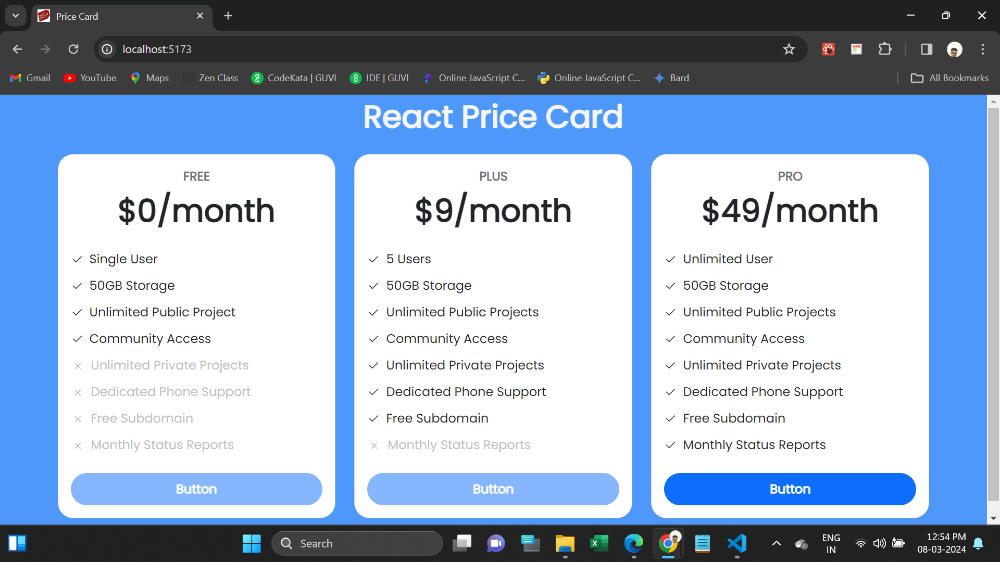

<h1>React Price Cards Task</h1>

This webpage is used to show subscription package in a webpage.

In this page holds Subscription Amount, and features.

Its completely Responsive.

I used Html,CSS,Bootstrap,ReactJS using Components for developing this page with Responsive.

I attached Webpage Screenshots in below:
   

<h2>Website URL</h2>
https://react-pricecards.netlify.app/

<h2>Screenshots</h2>

1. Its main web page

 

